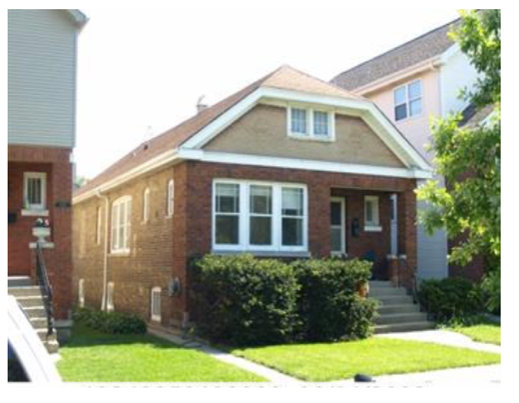

# The Assessment is Too Damn High: Overvaluation of Bungalows in the Bell School Area of Chicago

Ross Hyman

According to the Cook County Assessor, the estimated market value of my home, a one-story ninety-six-year-old Chicago bungalow in the Bell School area of Chicago jumped from $\$343,360$ in $2020$ to $\$720,000$ in $2021$. Many of my neighbors received similar shocking assessments. A quick search on Redfin, which I conducted upon receiving my assessment, shows that in 2018, three bungalows in our neighborhood sold for $\$300,000$, $\$485,000$, and $\$510,000$. One sold in $2021$ for $\$445,000$. How is it possible for the Assessor’s estimated market value of our homes to be so much higher than the values that they are being sold for? This is the question that was on my mind and wallet when I was asked to choose a capstone project for the data science course I am taking at Springboard. This is the report for that project. 
